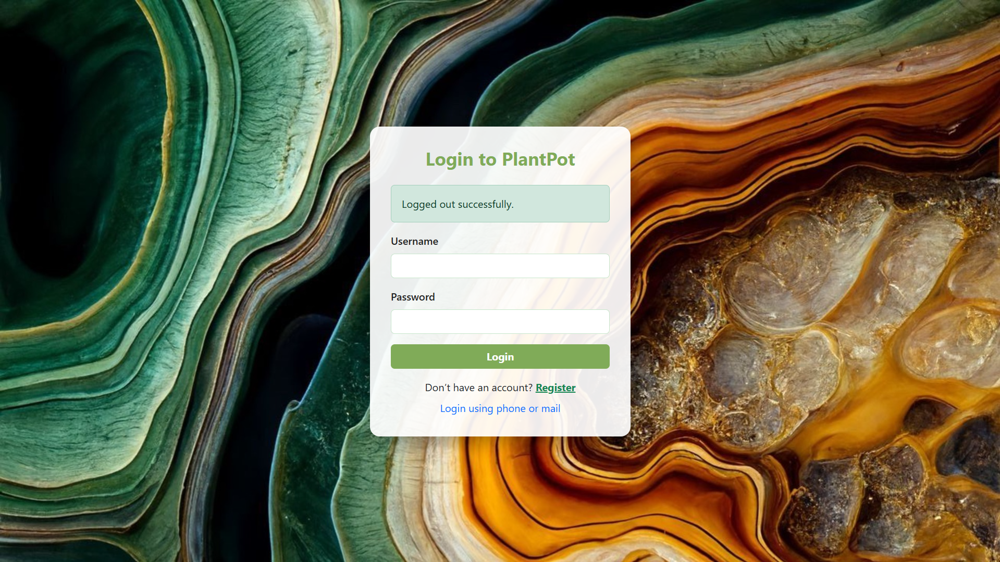
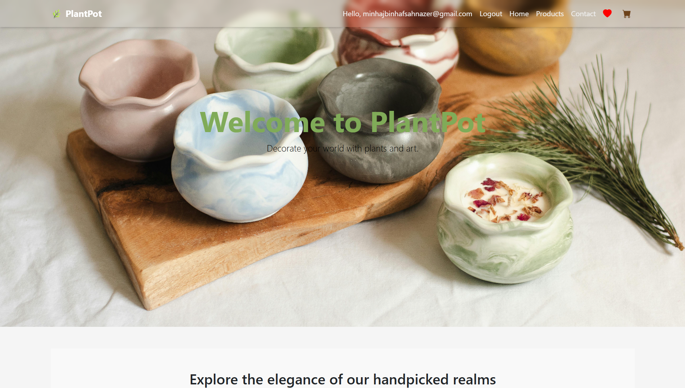
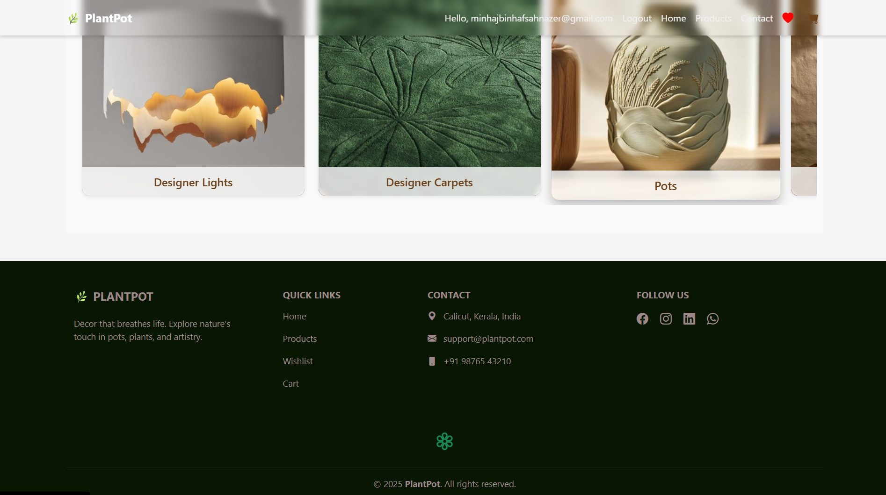
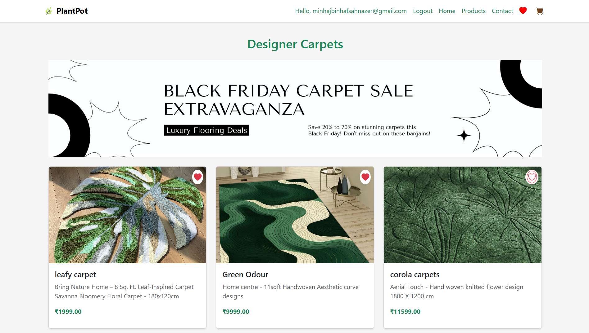
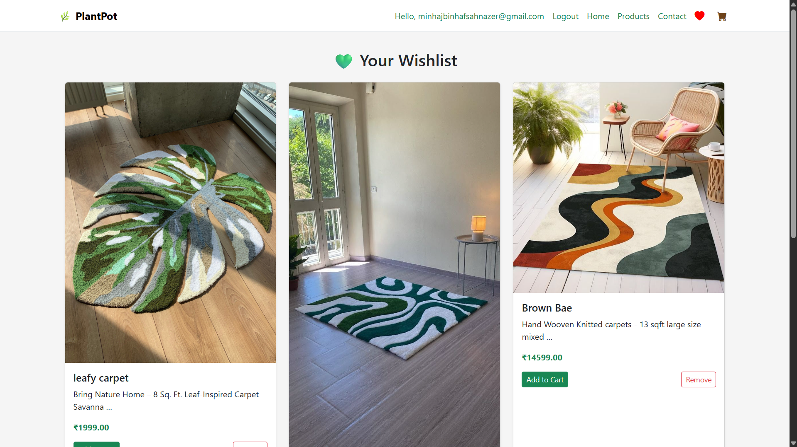
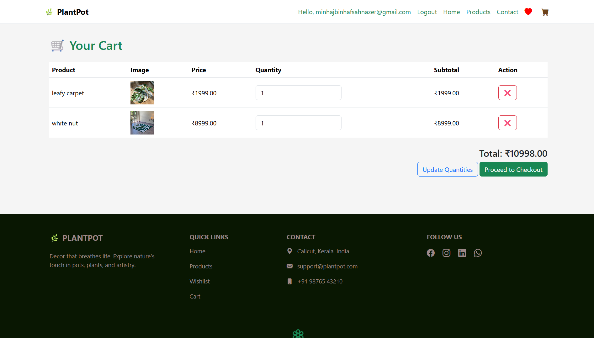

# 🪴 PlantPot — E-commerce Platform for Interior Decor & Designer Goods

PlantPot is a Django-powered e-commerce platform crafted for selling Pots, lights, interior decorations, furniture, and artisanal pieces. It’s a responsive and modern web app designed with simplicity, speed, and user experience in mind.

# login page

# nav-bar & hero

# home page

# home page & footer

# product listings

# wishlist

# checkout


---

## ✨ Features

- 🛍️ **Product Listings** with categories (plants, decor, furniture, more)
- 🔍 **Product Detail View** with price, description, and image
- 🧡 **Wishlist** system with toggle support
- 🛒 **Shopping Cart** with quantity updates and subtotal calculation
- 🔐 **User Authentication** (login, register, logout, OTP login support)
- 🎊 **Confetti greeting animation** on OTP login
- 💬 **Toast alerts** for cart/wishlist actions
- 📱 Fully **responsive UI** with Bootstrap 5
- 🎨 Clean and intuitive layout, minimal distraction

---

## 📦 Tech Stack

| Layer         | Technology                                                                |
|---------------|---------------------------------------------------------------------------|
| Backend       | Django — RESTful architecture, clean MVT design                           |
| Frontend      | HTML, CSS, Bootstrap 5, JavaScript, jQuery — fully responsive UI          |
| Auth System   | Django Auth + OTP-based login — secure and mobile-friendly authentication |
| Cart & Order  | Dynamic cart with quantity updates, item removal, subtotal calculations   |
| Wishlist      | Persistent wishlist with toggle feature                                   |
| Database      | SQLite for development, mySQL for production                              |
| Static/Media  | Django's static/media handling — supports image upload for products       |
| Payment       |    Ready for integration with Stripe (WIP)                                |
| Confetti UX   | Confetti animation & dynamic greeting overlay on successful OTP login     |
| Screenshots   | Included in `/screenshots` for visual walkthrough                         |
| Deployment    | Easy deploy on PythonAnywhere, Render                                     |
| Responsiveness| Fully mobile-optimized: form flows, modals, and navbar                    |
| Modularity    | Organized app structure for scalability (`plantapp/`, `templates/`, etc.) |


---

## 🚀 Getting Started

### 1. Clone the Repo

```bash
git clone https://github.com/yourusername/plantpot.git
cd plantpot
